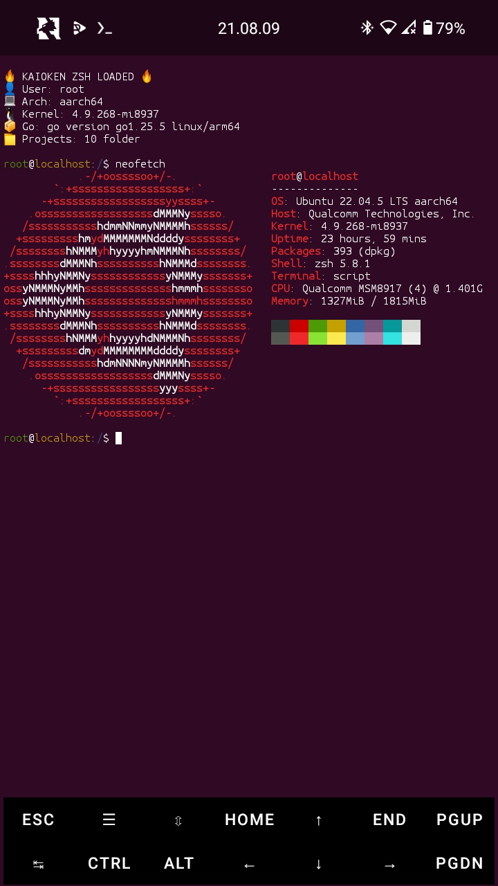

# System Specifications

## Machine Information
- **User**: root
- **OS**: Ubuntu 22.04.5 LTS
- **Architecture**: aarch64 (ARM64)
- **Kernel**: 4.9.268-nt8937
- **Host**: Qualcomm Technologies, Inc.
- **Shell**: zsh 5.8.1 with KAIOKEN theme
- **Uptime**: 24 hours

## Hardware
- **CPU**: Qualcomm MSMB917 (4 cores) @ 1.401GHz
- **Memory**: 1.8GB total, 1.3GB used
- **Storage**: Not specified

## Development Stack
- **Go**: version go1.25.5 linux/arm64
- **C Compiler**: gcc (to be installed)
- **Package Manager**: dpkg (393 packages installed)
- **Terminal**: script

## Visual

## Notes
- Running on ARM architecture
- Custom ZSH theme: KAIOKEN
- Stable for development work
